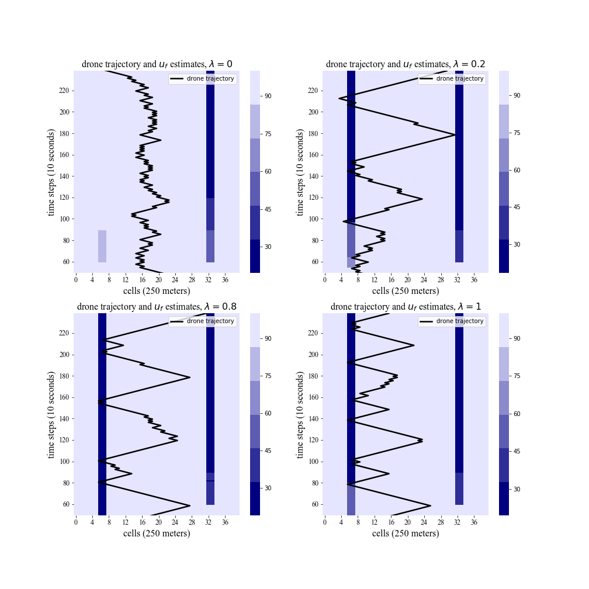

## UAV path planning
contains code for ensemble Kalman filtering, traffic simulation (cell transmission model), and UAV navigation

### Overview
  * Network.py: main script for network loading
  * Node.py: abstract base class for node models
  * nodeModel.py: implements series and diverge nodes
  * link.py: abstract base class for node models
  * linkModel.py: implements the link model (cell transmission model)
  * utils.py: utility functions for reading data, creating ensembles, observation function, switching between celss and km
  * EnKF.py: ensemble Kalman filter class for creating different EnKF instances (traffic densities & model parameters within separate EnKFs)
  * findPath.py: finding path with least anticipated uncertainty (maximum reduction in variance on estimates)
  * main.py: master script for running simulation
  
  
  
  @cesaryahia@utexas.edu
